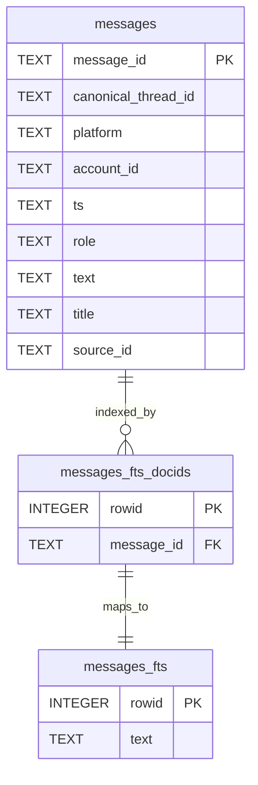

# Chat Export Structurer

[](https://opensource.org/licenses/MIT)
[](https://github.com/1ch1n/chat-export-structurer/releases)
[](https://github.com/1ch1n/chat-export-structurer/actions/workflows/test.yml)
[](https://www.python.org/downloads/)
[](https://github.com/1ch1n/chat-export-structurer/issues)

---

> **"The next era of AI won't be won by who prompts best. It will be won by who holds context best."**

If you're building with AI, you know the problem: every conversation starts from zero, your best insights get buried in exported JSON, and there's no memory layer connecting it all.

This tool is the foundation. A clean, local-first parser that turns messy AI exports into structured SQLite archives—ready for search, RAG, agents, or whatever you're building next.

**Part of [MyChatArchive](https://mychatarchive.com)** — a full platform for AI memory and context. Launching Q1 2025.

---

## What It Does

Convert messy AI chat exports into clean, queryable SQLite archives. Own your data. Build your memory layer.

Supports ChatGPT, Claude (Anthropic), and Grok exports. No API keys, no cloud services, just local SQLite.

## Why Use This

- **Own your data** — Everything stays local. No cloud, no API keys, no tracking
- **Search everything** — Built-in full-text search (FTS5) across all your conversations
- **Never lose context** — SHA1-based deduplication keeps your archive clean across imports
- **Multi-platform** — Works with ChatGPT, Claude, and Grok exports (more coming)
- **Production-ready** — Streaming parser handles multi-GB files without breaking
- **Safe testing** — Preview mode lets you inspect data before writing to database

## Installation

```bash
git clone https://github.com/1ch1n/chat-export-structurer.git
cd chat-export-structurer
pip install -r requirements.txt
```

**Requirements:**
- Python 3.8+
- `ijson` for streaming JSON
- `tqdm` for progress indicators (optional)

## Quick Start

Get started in under 2 minutes:

### 1. Export Your Data

**ChatGPT:**  
Settings → Data controls → Export data → Download `conversations.json`

**Anthropic Claude:**  
Settings → Export data

**Grok (X.AI):**  
Settings → Export conversations

### 2. Test Import

Try the included sample database:

```bash
sqlite3 examples/sample_archive.sqlite "SELECT title, role, text FROM messages LIMIT 5;"
```

Or test parsing your own export:

```bash
python src/ingest.py \
  --in path/to/export.json \
  --format chatgpt \
  --test
```

### 3. Import to SQLite

```bash
python src/ingest.py \
  --in path/to/export.json \
  --db my_archive.sqlite \
  --format chatgpt
```

### 4. Query Your Data

```bash
sqlite3 my_archive.sqlite

# Search messages
SELECT role, text, ts FROM messages 
WHERE text LIKE '%python%' 
LIMIT 10;

# Full-text search
SELECT m.text, m.ts 
FROM messages_fts 
JOIN messages_fts_docids d ON messages_fts.rowid = d.rowid
JOIN messages m ON m.message_id = d.message_id
WHERE messages_fts MATCH 'machine learning';

# Count conversations
SELECT COUNT(DISTINCT canonical_thread_id) FROM messages;
```

## Usage

```bash
python src/ingest.py --in INPUT --format FORMAT [--db DATABASE] [OPTIONS]
```

### Arguments

| Argument | Required | Description |
|----------|----------|-------------|
| `--in` | Yes | Path to export JSON file |
| `--format` | Yes | Export format: `chatgpt`, `anthropic`, or `grok` |
| `--db` | Conditional | SQLite database path (required unless `--test`) |
| `--test` | No | Preview mode - no database writes |
| `--account` | No | Account identifier (default: `main`) |
| `--source-id` | No | Batch ID (default: `src_0001`) |

## Supported Formats

### ChatGPT

```bash
python src/ingest.py \
  --in conversations.json \
  --db archive.sqlite \
  --format chatgpt
```

### Anthropic Claude

```bash
python src/ingest.py \
  --in claude_export.json \
  --db archive.sqlite \
  --format anthropic
```

### Grok

```bash
python src/ingest.py \
  --in grok_export.json \
  --db archive.sqlite \
  --format grok
```

### Combine Multiple Platforms

```bash
# Import from different platforms into one database
python src/ingest.py --in chatgpt.json --db unified.sqlite --format chatgpt
python src/ingest.py --in claude.json --db unified.sqlite --format anthropic
python src/ingest.py --in grok.json --db unified.sqlite --format grok

# Duplicates are automatically skipped
```

## Database Schema

### Entity Relationship



### `messages` table

```sql
CREATE TABLE messages (
  message_id TEXT PRIMARY KEY,
  canonical_thread_id TEXT NOT NULL,
  platform TEXT NOT NULL,
  account_id TEXT NOT NULL,
  ts TEXT NOT NULL,
  role TEXT NOT NULL,
  text TEXT NOT NULL,
  title TEXT,
  source_id TEXT NOT NULL
);
```

### Full-text search

Uses SQLite FTS5 for fast text queries:
- `messages_fts` - Virtual FTS table (indexed text content)
- `messages_fts_docids` - Maps FTS rowids to message IDs for joins

## Example Queries

### Find questions about a topic

```sql
SELECT text, ts FROM messages 
WHERE role = 'user' 
AND text LIKE '%kubernetes%'
ORDER BY ts DESC;
```

### Most active conversations

```sql
SELECT title, COUNT(*) as message_count
FROM messages
GROUP BY canonical_thread_id
ORDER BY message_count DESC
LIMIT 10;
```

### Export to CSV

```bash
sqlite3 -header -csv archive.sqlite \
  "SELECT * FROM messages WHERE ts >= '2024-01-01'" \
  > 2024_messages.csv
```

## Example Data

The `examples/` directory includes:
- Sample export files from each platform (JSON format)
- `sample_archive.sqlite` - Pre-built database with 12 messages from all three platforms

Try querying the sample database:

```bash
# View all conversations
sqlite3 examples/sample_archive.sqlite "SELECT DISTINCT title, platform FROM messages;"

# Search for specific terms
sqlite3 examples/sample_archive.sqlite "SELECT role, text FROM messages WHERE text LIKE '%learning%';"
```

## What's Next

This parser is the foundation. The full [MyChatArchive](https://mychatarchive.com) platform (launching Q1 2025) will add:

- **Web UI** for browsing and filtering your archive
- **Vector search** for semantic queries across conversations  
- **AI synthesis** to surface insights and patterns
- **Enhanced exports** to Markdown, CSV, and agent-ready formats

This open-source tool will always remain free and stay at the core of the stack.

**Want early access?** Star the repo and watch for updates, or check [MyChatArchive.com](https://mychatarchive.com).

---

## Roadmap

**Export Structurer (this tool):**
- [x] ChatGPT, Claude, and Grok parsers
- [ ] Additional platforms (Gemini, Perplexity, Copilot, etc.)
- [ ] Advanced deduplication and merge strategies
- [ ] CLI improvements (progress bars, better error handling)

## Contributing

This tool uses a modular parser architecture. Adding support for a new platform is straightforward.

### Add a Parser

Create `src/parsers/your_platform.py`:

```python
from typing import Iterator, Dict

def parse(input_path: str) -> Iterator[Dict]:
    """
    Yield normalized messages with:
    - thread_id: str
    - thread_title: str
    - role: str ("user", "assistant", or "system")
    - content: str
    - created_at: float (Unix timestamp)
    """
    # Your parsing logic
    pass
```

Register in `src/ingest.py`:

```python
from parsers import chatgpt, anthropic, grok, your_platform

PARSERS = {
    "chatgpt": chatgpt,
    "anthropic": anthropic,
    "grok": grok,
    "your_platform": your_platform
}
```

Test it:

```bash
python src/ingest.py --in export.json --format your_platform --test
```

### Pull Requests

1. Test with real exports
2. Add example file to `examples/`
3. Update README
4. No external API dependencies
5. Follow existing code style

## License

MIT License - free for everyone, including commercial use.

See [LICENSE](LICENSE) for full terms.

**Want the full platform?** [MyChatArchive.com](https://mychatarchive.com) (launching Q1 2025) will add:
- Web UI with zero setup
- Vector search and AI synthesis
- Team collaboration features
- Cloud sync (optional - local-first stays free)

---

**Built by Channing Chasko · [MyChatArchive.com](https://mychatarchive.com) (Q1 2025)**

Released under the [MIT License](LICENSE).
